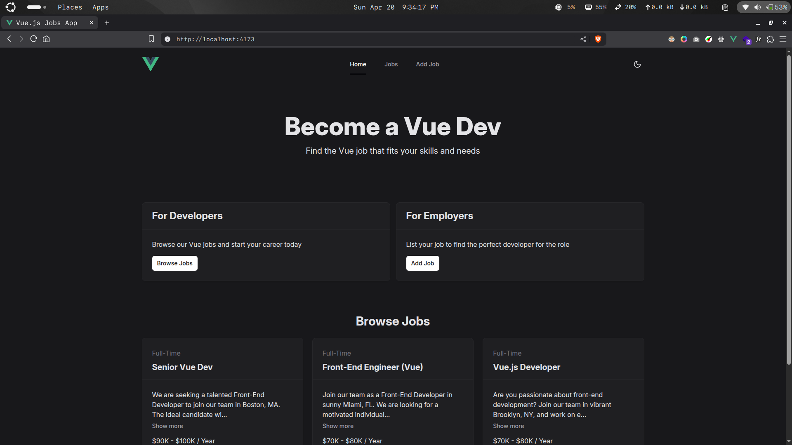

# Vue.js Jobs App

A simple jobs posting app built using Vue.js (Front-End) and JSON server (Back-end).

[**Live Preview**](https://vue-jobs-app-frontend.onrender.com) of the project.

**NOTE:** The backend may be on sleep so, it may take some time while loading data for first time *(approximately 30 - 40s for startup)*.

## Technologies Used

- [x] Vue.js
- [x] Nuxt UI
- [x] JSON Server
- [x] Tailwind CSS

## Features

- Dark and Light Mode
- CRUD with JSON Server

## Local setup

### Install dependencies

**NOTE:** If using package manager other than `pnpm` first remove `pnpm-lock.yaml` and `pnpm-workspace.yaml` files and use `npm` instead of `pnpm` or your package manager name.

- Install dependencies

  ```sh
  pnpm install
  ```

- Build the project

  ```sh
  pnpm build
  ```

- Open preview build

  ```sh
  pnpm start-preview
  ```

## Preview


